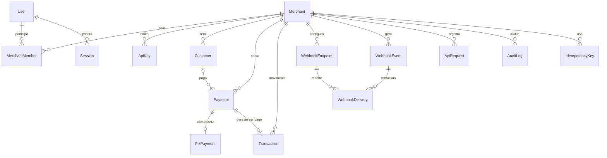

# NexoPay — Modelo de Domínio

> Documentos relacionados: [PRD.md](PRD.md) · [ARCHITECTURE.md](ARCHITECTURE.md)

Este documento define **o que cada conceito é, o que ele NÃO é, e como os conceitos se relacionam**.
Em caso de dúvida sobre onde uma regra deve viver, a resposta começa aqui.

---

## 1. Linguagem ubíqua

| Termo (código)    | Termo (UI, pt-BR)    | Definição curta                                    |
| ----------------- | -------------------- | -------------------------------------------------- |
| `Merchant`        | Conta / Empresa      | Quem usa a NexoPay para cobrar.                    |
| `MerchantMember`  | Membro               | Vínculo entre um usuário e um Merchant, com papel. |
| `User`            | Usuário              | Pessoa que acessa o dashboard.                     |
| `Customer`        | Cliente / Pagador    | Quem paga.                                         |
| `Payment`         | Cobrança / Pagamento | A intenção de cobrar um valor.                     |
| `PixPayment`      | Dados PIX            | Instrumento PIX de um Payment.                     |
| `Transaction`     | Transação            | Movimentação financeira efetiva.                   |
| `WebhookEndpoint` | Endpoint de webhook  | URL do merchant que recebe eventos.                |
| `WebhookEvent`    | Evento               | Algo que aconteceu.                                |
| `WebhookDelivery` | Tentativa de entrega | Uma tentativa de entregar um evento a um endpoint. |
| `ApiKey`          | Chave de API         | Credencial de aplicações externas.                 |
| `Environment`     | Ambiente             | `SANDBOX` ou `PRODUCTION` (apenas SANDBOX no MVP). |
| `Provider`        | Provedor             | Infraestrutura financeira real (abstraída).        |
| `Ledger`          | Livro razão          | Registro financeiro imutável (futuro).             |
| `Balance`         | Saldo                | Valor derivado do Ledger (futuro).                 |
| `Refund`          | Reembolso            | Devolução de um Payment (futuro).                  |
| `Payout`          | Saque / Repasse      | Retirada de saldo pelo merchant (futuro).          |

---

## 2. Conceitos transversais

### 2.1 Dinheiro

- Todo valor monetário é um **inteiro em centavos** (`amount: 1990` = R$ 19,90).
- Moeda: `BRL` (campo `currency` existe para evolução, mas só `BRL` é aceito).
- Proibido: `float`, `number` com casas decimais, `Decimal` em regras de domínio.
- Valores de Payment/Transaction: `Int` (32 bits) com limite técnico validado. Somatórios e saldos futuros: `BigInt`.

### 2.2 Ambiente (`Environment`)

- Todo recurso de tenant carrega `environment`: `SANDBOX` | `PRODUCTION`.
- O ambiente de uma requisição é **derivado da credencial**: `sk_test_` → `SANDBOX`, `sk_live_` → `PRODUCTION`.
- Dados de ambientes diferentes **nunca se misturam** (um `sk_test_` jamais vê dados de produção).
- No MVP, apenas `SANDBOX` está habilitado; `PRODUCTION` existe no modelo para evitar migração futura dolorosa.

### 2.3 Multi-tenancy

- Todo recurso de negócio pertence a **um** Merchant (`merchantId`) e **um** ambiente.
- Nenhuma consulta de recurso de tenant é feita apenas por `id`: sempre `merchantId + environment + id`.
- Recurso de outro tenant é tratado como **inexistente** (404).

### 2.4 IDs públicos

IDs públicos são opacos, prefixados e ordenáveis no tempo (`<prefixo>_<ULID>`), ex.: `pay_01JABCDE...`.
São a chave primária das entidades públicas — não existe um "ID interno" paralelo para vazar.

| Prefixo | Entidade        | Exposto         |
| ------- | --------------- | --------------- |
| `mer_`  | Merchant        | Sim             |
| `usr_`  | User            | Sim (dashboard) |
| `cus_`  | Customer        | Sim             |
| `pay_`  | Payment         | Sim             |
| `txn_`  | Transaction     | Sim             |
| `evt_`  | WebhookEvent    | Sim             |
| `whk_`  | WebhookEndpoint | Sim             |
| `dlv_`  | WebhookDelivery | Sim (dashboard) |
| `key_`  | ApiKey          | Sim             |
| `req_`  | ApiRequest      | Sim             |

Entidades **internas** (nunca expostas pela API): `MerchantMember`, `Session`, `PixPayment`
(identificado pelo `paymentId`), `IdempotencyKey`, `AuditLog` — usam UUID.

> `usr_`, `txn_` e `dlv_` complementam a lista original de prefixos por serem exibidos no dashboard.

---

## 3. Entidades

### 3.1 Merchant

**É:** a empresa ou projeto que utiliza a NexoPay para cobrar. Unidade de isolamento (tenant).

**Não é:** um usuário. Um Merchant pode ter vários usuários; um usuário pode pertencer a vários Merchants.

- Campos principais: `id (mer_)`, `name`, `createdAt`.
- Dados cadastrais/fiscais (CNPJ, KYB) ficam para o modo produção.
- Invariante: todo Merchant tem ao menos um membro `OWNER`.

### 3.2 User e MerchantMember

**User** é a pessoa que acessa o dashboard (email + senha). **MerchantMember** liga User ↔ Merchant com um papel.

- Papéis: `OWNER` (MVP). `ADMIN` e `DEVELOPER` previstos no modelo; convites ficam para a fase 1.1.
- Senha armazenada somente como hash (Argon2id, formato PHC).
- `email` é armazenado normalizado (minúsculas) e é único.
- Sessões (`Session`) são registros do servidor com token aleatório armazenado como hash.

### 3.3 Customer

**É:** a pessoa (física ou jurídica) que paga.

**Não é:** um usuário do dashboard, nem um Merchant.

- Campos: `id (cus_)`, `merchantId`, `environment`, `name`, `email?`, `taxId?` (CPF/CNPJ), `phone?`, `metadata?`.
- `taxId` validado por dígitos verificadores; armazenado apenas com dígitos.
- Dados pessoais (`email`, `taxId`, `phone`) **nunca** vão para logs.
- Um Payment pode existir sem Customer.

### 3.4 Payment

**É:** uma **cobrança** — a intenção de receber um valor de alguém, por um método.

**Não é:** dinheiro movimentado. Um Payment `PENDING` não representa nenhum valor recebido.

- Campos: `id (pay_)`, `merchantId`, `environment`, `customerId?`, `amount`, `currency`, `method (PIX)`,
  `status`, `description?`, `metadata?`, `expiresAt`, `paidAt?`, `failedAt?`, `expiredAt?`, `refundedAt?`.
- Estados: `PENDING` · `PAID` · `FAILED` · `EXPIRED` · `REFUNDED`.

```text
            ┌──────────► PAID ──────────► REFUNDED (futuro)
            │
 PENDING ───┼──────────► FAILED
            │
            └──────────► EXPIRED
```

| De        | Para       | Gatilho                                      | Efeitos                                      |
| --------- | ---------- | -------------------------------------------- | -------------------------------------------- |
| —         | `PENDING`  | `POST /v1/payments`                          | PixPayment criado · evento `payment.created` |
| `PENDING` | `PAID`     | Confirmação do provider (sandbox: simulator) | **1** Transaction · evento `payment.paid`    |
| `PENDING` | `FAILED`   | Falha reportada pelo provider                | evento `payment.failed` (fase 1.1)           |
| `PENDING` | `EXPIRED`  | `now >= expiresAt`                           | evento `payment.expired` (fase 1.1)          |
| `PAID`    | `REFUNDED` | Refund concluído (futuro)                    | Transaction de débito · `payment.refunded`   |

Invariantes:

1. `amount` é inteiro positivo e **imutável** após a criação.
2. Estados terminais (`FAILED`, `EXPIRED`, `REFUNDED`) não transitam para nenhum outro estado.
3. `PAID` só transita para `REFUNDED`.
4. Transição para o estado atual é **no-op idempotente** (confirmar um `PAID` não gera efeitos).
5. As regras de transição vivem no **domínio** (entidade Payment), nunca em controller, repository ou provider.

### 3.5 PixPayment

**É:** o instrumento PIX de um Payment — os dados necessários para o pagador pagar.

**Não é:** o Payment. Status e valor pertencem ao Payment.

- Relação 1:1 com Payment (`paymentId` como chave).
- Campos: `brCode` (copia-e-cola), `provider` (`sandbox`), `providerReference` (único por provider), `expiresAt`, `endToEndId?` (identificador da liquidação, quando pago).
- QR Code é derivado do `brCode` (não é armazenado como imagem).
- **Sandbox:** o BR Code usa o GUI `com.nexopay.sandbox` e nenhuma chave PIX real — nunca é pagável em apps bancários.

### 3.6 Transaction

**É:** uma **movimentação financeira efetiva** — dinheiro que de fato entrou ou saiu.

**Não é:** um Payment. Payment e Transaction **NÃO são a mesma coisa**:

| Payment                                   | Transaction                                    |
| ----------------------------------------- | ---------------------------------------------- |
| Intenção de cobrança                      | Fato financeiro consumado                      |
| Existe desde a criação (`PENDING`)        | Só existe quando há movimentação (`PAID`)      |
| Tem estados e transições                  | **Imutável**; correções são novas Transactions |
| Pode expirar/falhar sem efeito financeiro | Sempre tem efeito financeiro                   |

- Campos: `id (txn_)`, `merchantId`, `environment`, `type`, `amount`, `feeAmount`, `netAmount`, `currency`, `paymentId?`, `createdAt`.
- Tipos: `PAYMENT` (crédito, MVP) · `REFUND` (débito, futuro) · `PAYOUT` (débito, futuro).
- Invariante: **no máximo uma Transaction `PAYMENT` por Payment** (constraint única `paymentId + type`).
- `netAmount = amount - feeAmount`; no sandbox `feeAmount = 0`.

### 3.7 WebhookEndpoint

**É:** uma URL do merchant que recebe eventos, com a lista de tipos assinados.

- Campos: `id (whk_)`, `merchantId`, `environment`, `url`, `events[]`, `secret` (criptografado), `status` (`ENABLED` | `DISABLED`), `description?`.
- O `secret` (`whsec_...`) é exibido **uma vez** na criação e usado para assinar as entregas.

### 3.8 WebhookEvent

**É:** o registro de **algo que aconteceu** no domínio, com um snapshot do recurso no momento.

**Não é:** uma entrega. Um evento existe mesmo que nenhum endpoint esteja configurado.

- Campos: `id (evt_)`, `merchantId`, `environment`, `type`, `resourceType`, `resourceId`, `data` (snapshot JSON), `createdAt`, `dispatchedAt?`.
- Tipos:

| Tipo               | Quando              | MVP      |
| ------------------ | ------------------- | -------- |
| `payment.created`  | Payment criado      | ✅       |
| `payment.paid`     | Payment confirmado  | ✅       |
| `payment.failed`   | Payment falhou      | Fase 1.1 |
| `payment.expired`  | Payment expirou     | Fase 1.1 |
| `payment.refunded` | Payment reembolsado | Futuro   |

- Criado **na mesma transação de banco** que a mudança de estado que o originou (outbox transacional).
- Imutável.

### 3.9 WebhookDelivery

**É:** **uma tentativa** de entregar um WebhookEvent a um WebhookEndpoint.

- Campos: `id (dlv_)`, `eventId`, `endpointId`, `attempt` (1..N), `status` (`PENDING` | `SUCCEEDED` | `FAILED`),
  `responseStatus?`, `responseBody?` (≤ 2 KB), `durationMs?`, `error?`, `nextRetryAt?`, `createdAt`.
- Um evento × endpoint pode ter várias deliveries (retries). Única por `eventId + endpointId + attempt`.
- O sucesso de **qualquer** tentativa encerra o ciclo daquele par evento × endpoint.

### 3.10 ApiKey

**É:** a credencial que autentica aplicações externas na API pública.

- Formato: `sk_test_<segredo>` (sandbox) · `sk_live_<segredo>` (produção, futuro).
- Persistido: `id (key_)`, `merchantId`, `environment`, `name`, `hash` (HMAC-SHA256 com pepper), `hint` (`sk_test_…a1b2`), `lastUsedAt?`, `revokedAt?`, `createdByUserId`, `revokedByUserId?`.
- **Nunca** armazenada em texto puro; exibida uma única vez.
- Revogação é imediata e irreversível.
- Uma ApiKey identifica **Merchant + ambiente** de cada request.

### 3.11 Provider

**É:** a abstração da infraestrutura financeira real (PSP, banco).

**Não é:** uma entidade de banco de dados nem uma fonte de regras de negócio.

- Representado por **portas** (interfaces) como `PixProvider.createPix(input): Promise<PixResult>`.
- O provider **informa fatos** (PIX criado, PIX liquidado); o **domínio decide** o que fazer.
- MVP: `SandboxPixProvider`. Nenhum PSP real é integrado.
- Qual provider gerou um PIX fica registrado em `PixPayment.provider` + `providerReference`.

### 3.12 Ledger _(futuro)_

**É:** o livro financeiro **imutável**, em partidas dobradas.

- `LedgerAccount` (ex.: `merchant:mer_x:available`, `merchant:mer_x:pending`, `nexopay:fees`).
- `LedgerEntry`: lançamentos de débito/crédito; a soma de cada transação de ledger é **zero**.
- Cada Transaction gera lançamentos no ledger. Lançamentos nunca são alterados nem apagados.

### 3.13 Balance _(futuro)_

**É:** o saldo **derivado** do Ledger. Nunca editado diretamente.

- Saldos por Merchant, ambiente e conta (`available`, `pending`).
- Pode ser materializado/cacheado para performance, mas a fonte de verdade é o Ledger.

### 3.14 Refund _(futuro)_

**É:** a devolução (total ou parcial) de um Payment `PAID`.

- Gera Transaction `REFUND` (débito); reembolso total leva o Payment a `REFUNDED`.
- Soma dos refunds ≤ `amount` do Payment. Idempotente.

### 3.15 Payout _(futuro)_

**É:** a retirada de saldo disponível pelo Merchant para sua conta bancária.

- Gera Transaction `PAYOUT` (débito). Nunca pode deixar o saldo disponível negativo.

### 3.16 Entidades de suporte

| Entidade         | Responsabilidade                                                                       |
| ---------------- | -------------------------------------------------------------------------------------- |
| `IdempotencyKey` | Garante que `POST /v1/payments` repetido produz um único efeito (ver ARCHITECTURE §8). |
| `ApiRequest`     | Developer Log: um registro por request (`req_`), sem secrets.                          |
| `AuditLog`       | Trilha imutável de ações sensíveis (quem, o quê, quando, de onde).                     |
| `Session`        | Sessão de usuário do dashboard (token armazenado como hash).                           |

---

## 4. Relacionamentos



Resumo textual:

- **User ⟷ Merchant**: N:N via `MerchantMember` (com papel).
- **Merchant → tudo**: todo recurso de negócio pertence a um Merchant e a um ambiente.
- **Customer → Payment**: 1:N, opcional (Payment pode não ter Customer).
- **Payment → PixPayment**: 1:1 quando `method = PIX`.
- **Payment → Transaction**: 0..1 no MVP (crédito ao ser pago). Futuro: 1:N (refunds como débitos).
- **Payment → WebhookEvent**: 1:N, por referência (`resourceType = payment`, `resourceId = pay_...`).
- **WebhookEvent × WebhookEndpoint → WebhookDelivery**: cada tentativa de entrega é uma delivery.
- **Transaction → LedgerEntry** _(futuro)_: 1:N, partidas dobradas.
- **Ledger → Balance** _(futuro)_: saldo é derivado, nunca armazenado como verdade.
- **Refund → Payment**, **Payout → Merchant** _(futuro)_: ambos geram Transactions de débito.

---

## 5. Fluxo de vida de um pagamento sandbox

```text
POST /v1/payments  (Idempotency-Key)
  └─ Payment PENDING + PixPayment (SandboxPixProvider)
  └─ WebhookEvent payment.created ──► fila ──► WebhookDelivery(s)

POST /v1/test/payments/:id/confirm
  └─ Payment PENDING → PAID              (update condicional)
  └─ Transaction PAYMENT (única por Payment)
  └─ WebhookEvent payment.paid ──► fila ──► WebhookDelivery(s) ──► endpoint do merchant

POST /v1/test/payments/:id/confirm  (de novo)
  └─ Payment já PAID → 200, nenhum efeito novo
```
